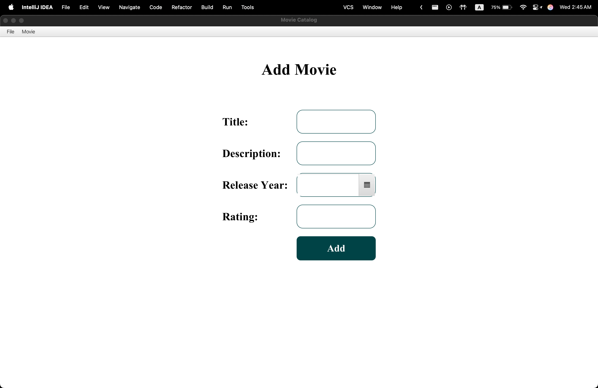
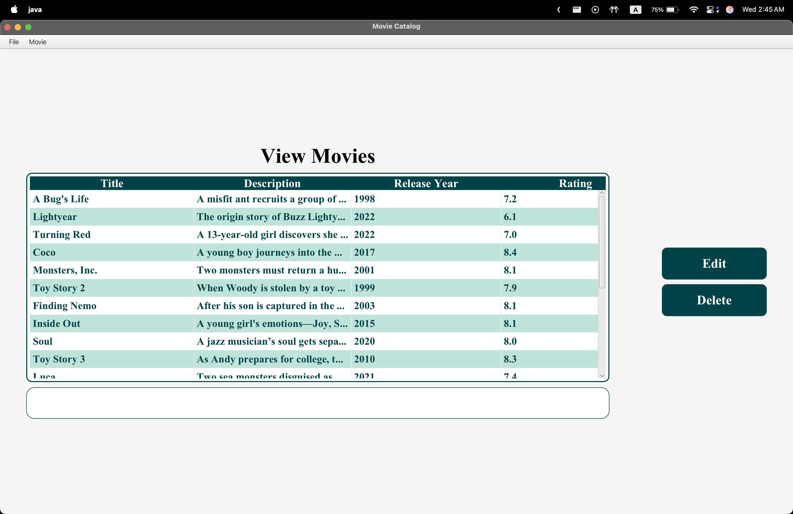
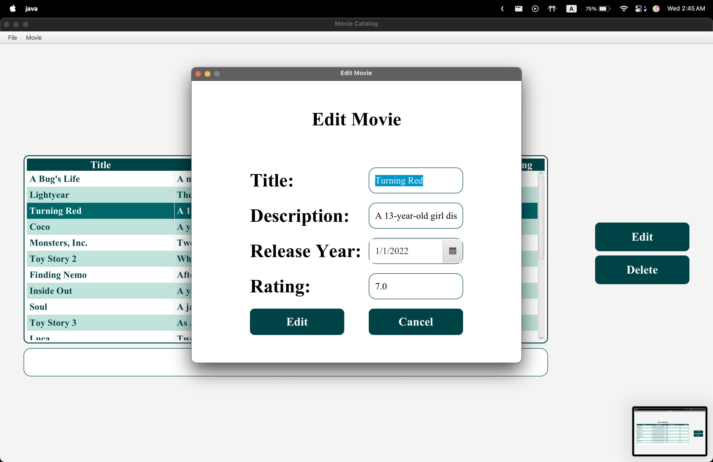
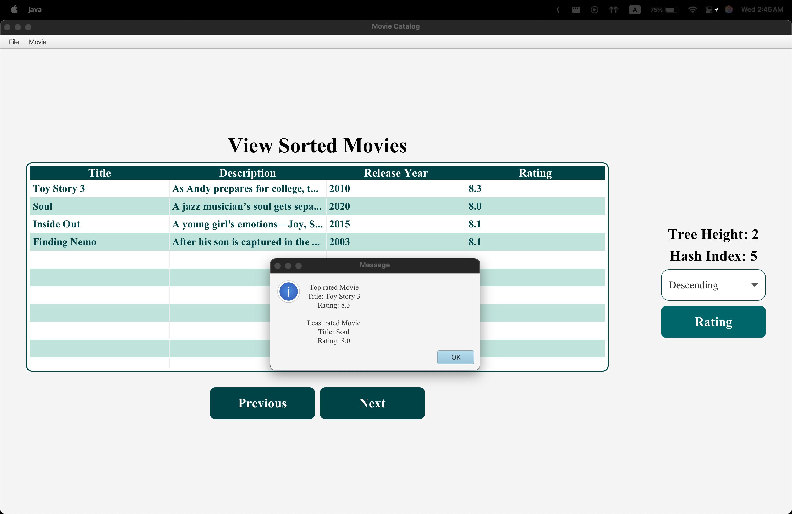

# Data-Structure-Movie-Catalog

# Movie Catalog Management System

## 📚 Project Overview

Movie Catalog Management System uses a hash table with AVL trees to manage movies inclus:

- Storing movies as key-value pairs (title as key, movie details as value)
- Collision resolution via AVL trees for balanced, fast lookup
- Dynamic resizing of the hash table based on AVL tree heights
- File operations to save/load the movie catalog
- JavaFX GUI with TableView and menus for managing movies

---

## 🛠️ Data Structures Used

- **Hash Table** → Organizes movies by hashing the movie title
- **AVL Tree** → Handles collisions inside each hash cell, keeping data balanced and searchable efficiently

---

## 🚀 Features

### 🎬 Movie Management

- Add new movies or update existing ones
- Delete movies
- Search movies by title or release year
- Display sorted movie lists
- View top and least ranked movies in each AVL tree segment

### 📁 File Operations

- Load movie data from a formatted text file
- Save the current movie catalog to file

## Screenshots of the App

